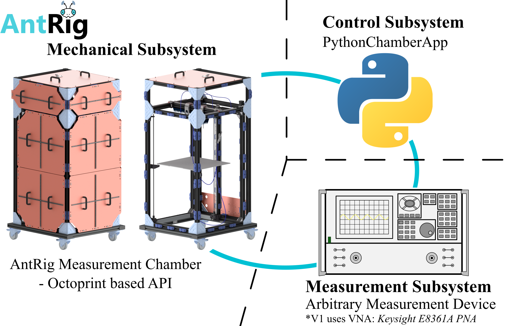

# AntRig-Measurement-System
The __AntRig-Measurement-System__ is an open source radio frequency measurement setup for planar and volumetric near field measurements.
The project launched during a master's thesis at the _Institute of High-Frequency Technology_ at the _TUHH_ (see [Meta](#meta)).
The intended application is near field analysis of antennas in a 3D volume.
However, the developed system is not limited to any specific measurement task but easily adaptable to cope with arbitrary radio frequency measurements.

This repository presents the software and hardware of the AntRig-Measurement-System to enable easy replication and modification.
The design is inspired by concepts from 3D printing and reuses common 3D-printer-hardware to facilitate a highly cost-effective measurement setup. 
The [RatRig VCore 3.1](https://docs.ratrig.com/product-details/v-core3-1) set the base for the first generation of measurement system.

This file gives you a quick overview of the project, its goals and what can be found in this repository.

## Project Goals
* Provide the community with a **powerful and flexible measurement system solution** for arbitrary high frequency measurements
* Realize a **cost-effective** and **space-efficient** setup, deployable in small scale laboratories with little financial resources
* Enable **easy replication and modification** of the system for anyone, for any measurement task
* Collect ideas and concepts from different fields & teams to come up with the **most effective and versatile measurement-system-base**

## Repository Overview
The __AntRig-Measurement-System__ is developed with a focus on modularity.
It is divided into three subsystems:
1. The Mechanical Subsystem (the AntRig measurement chamber)
2. The Measurement Subsystem (e.g., an OEM Vector Network Analyzer (VNA) or similar)
3. The Control Subsystem (the _PythonChamberApp_)

The __Mechanical Subsystem__ runs by the headline _AntRig Measurement Chamber_.
This repository provides a [detailed CAD model](/CAD_and_Manufacturing/AntRig_Chamber_V1.stp) of the measurement chamber. 
Additionally, a short instruction section provides information about what hardware is required for the setup, 
where it may be purchased and how to assemble the mechanical subsystem.
Moreover, it is shortly described how to commission the setup.

The __Measurement Subsystem__ is not part of this repository. 
In the end this subsystem consists of OEM devices that must be purchased separately or may be available in the working-group already.
The important aspect about the chosen measurement equipment is that it must allow for remote operation to be paired with
the control subsystem - the _PythonChamberApp_.

The __Control Subsystem__ is implemented as custom Python application and called _PythonChamberApp_.
It features a user interface to configure and monitor measurement processes.
Moreover, it controls the measurement chamber (mechanical subsystem) and the measurement equipment (measurement subsystem).
Thus, it is responsible for the automation of the measurement process and the data management.
Further down in this readme, the file and object structure of the _PythonChamberApp_ is described in detail,
alongside the [installation](#installation) and [usage](/PythonChamberApp/README.md) instructions.
Moreover, the measurement data format is described to enable further processing by other applications or scripts.



# AntRig Mechanical System - AntRig Measurement Chamber
> The AntRig Measurement Chamber is the mechanical setup of the AntRig-Measurement-System.
> This section provides information about the hardware setup, wiring and commissioning of the chamber.

## Bill of Materials
To replicate the mechanical setup several parts must be purchased, postprocessed or manufactured.
The __overall cost__ to buy and manufacture all required parts is __approximately 2800€__ (V1, built in 2024), 
exclusive the cost for postprocessing the acrylic glass panels, the aluminium plates and the base plate (original print bed by RatRig).

All purchased parts are organized in separate tables in the [BOM-File](/docs/BOM/AntRig_Chamber_V1_BOM.xlsx), uploaded in this repository.
The seven different sheets in the document correspond to different component types or different manufacturers/shops.

The __electrical system and actuators__ are purchased from the [RatRig shop](https://ratrig.com/) directly. 
Those are listed in the sheet "RatRig Parts" with the associated links (accessed February 2024).

The __3D printed parts__ may be in-house manufactured. 
However, for the first AntRig Measurement Chamber version, most parts were purchased at [JLC PCB](https://jlc3dp.com/).
This is recommended for groups that do not have the capacity to print the number of parts or can not print all materials (ABS, PLA, Resin). 
The structural parts are mostly made from ABS. ABS is beneficial due to its high toughness without cracking. 
Parts that are supposed to deform and pinch something and do not carry much load are printed from PLA, which is cheaper.
The enclosure connectors on panel-side are made from resin since this is the cheapest process at JLC PCB and there are no demanding mechanical requirements.
The probe head is a resin part as well to provide the highest stiffness and avoid any (even slow) deformation under stress.
These 3D printed parts are listed in the "3D Printed Parts" sheet with references to the associated stl files for fast ordering.

__Standard parts__ like screws and washers can be drawn from anywhere. These parts are organized in the "Standard Parts" sheet.

The __acrylic glass panels for the enclosure__ can be acquired from [Plattenzuschnitt24](https://www.plattenzuschnitt24.de/Plexiglas-Orange-2H02-GT-3mm.html).
The dimensions and numbers are listed in the lower table in the "Enclosure Order+Postprocessing" sheet [A18:C25].
These plates were postprocessed on a laser-cutter, namely the [Trotec Speedy SP500](https://www.troteclaser.com/en/laser-machines/laser-engravers-speedy-series?_gl=1%2anok0ia%2a_up%2aMQ..%2a_gs%2aMQ..&gclid=CjwKCAjwkvbEBhApEiwAKUz6-wC7UukCXgpPtQZoE6SbQvW6Ria9B6eV7ljH95KFUcEmMrQx3pjRDxoCvAUQAvD_BwE&gbraid=0AAAAApZqoLK33euWaj8qKxSJ9TsWBxm8-), which uses SVG files to create its command-set. 
The used SVGs are provided in the [CAD_and_Manufacturing/Enclosure_LaserCut_SVGs](/CAD_and_Manufacturing/Enclosure_LaserCut_SVGs/) directory.
Different colors are used to differentiate between cutting and engraving and control the cutting-sequence.

The __structural parts__ for the __frame assembly__ like joining plates and profiles can be drawn from [Item](https://de.item24.com/en/index.html).
These parts are listed with the associated links in the "ITEM Parts" sheet.
__Custom connector plates__ from aluminium must be manufactured or ordered separately. 
The technical drawings for these parts are provided [HERE](/CAD_and_Manufacturing/Technical_Drawings/). 
The parts are easily manufactured on a (CNC) milling machine or by water jet cutting from plates.

Lastly, there are __a few miscellaneous parts__ collected in the "Misc Parts" sheet, like the quick-connector for the Z-limit-switch and the magnets to attach the enclosure panels.

> [!NOTE]
> Parts that belong to the RF Measurement System (Measurement equipment + cables) are not listed in the BOM and out of scope for the cost-calculation!
> However, at the institute of high frequency technology, the [Keysight E8361A PNA Network Analyzer](https://www.keysight.com/de/de/product/E8361A/pna-series.html) is used as measurement device and [1.85mm General Purpose SMA Cables from _W.L. GORE_](https://www.gore.com/products/gore-microwave-rf-assemblies-general-purpose-test-solutions) with 700mm and 2000mm length are used inside the measurement chamber to connect the moving antennas to the outside of the setup. This combination enables accurate measurements at frequencies up to 67 GHz.

## Assembly Guide
The assembly of the mechanical system mostly aligns with the assembly of a standard RatRig V-Core 3.1 FDM printer.
Thus, for the general assembly this repository redirects to the [detailed assembly guide](https://docs.ratrig.com/v-core-3-1/v-core-mechanical) provided by RatRig.

Here is just a collection of hints where the assembly process deviates from the standrad RatRig instructions.

1. For the frame assembly [01] refer to the assembly of the __"Enclosed V-core 3.1"__ and find the corresponding profile lengths by comparing with [the provided step model](/CAD_and_Manufacturing/AntRig_Chamber_V1.stp).
2. When mounting the linear rails in section [03], watch out for the new positions of the rails that bear the x-gantry!
3. For the sections [04], [05] first study the provided AntRig Chamber Model in detail. The xy-actuation is (kind of) mounted upside-down on the frame. Thus, the assembly order can be followed but the orientation of the sub-assemblies has to be adjusted!
4. Since the x-gantry bearing is on the top side of the frame structure, the assembly of the joining parts at both ends must be re-orientated. However, the assembly process closely aligns to the RatRig instructions - just rethink the orientation of the parts during assembly and compare to the provided AntRig step model.
5. The __enclosure of the AntRig__ is a new design, therefore, no instructions are given in the RatRig documentation! A short description here:
    1. Collect all 3D printed connector parts for the enclosure.
    2. __Consider the magnet-orientation!__ In the beginning one must decide which pole faces away from the frame-side and towards the panel-side!
    3. Install all magnets in the associated holes. Dependent on the strength of your magnets __superglue might be a good idea__ to prevent that the magnets are pulled out of there connector-part later stage when attaching or detaching the enclosure from the chamber!
    4. _Loosely_ attach the connector-parts of the panel-side to the enclosure panels. 
    5. Put the screws and T-nuts into the frame-side connectors. Slightly turn the screw into the T-nut so they are fixed to the printed part but can be moved still.
    6. Connect the enclosure fixtures by their magnetic interface. Now both connector parts are loosely attached to the enclosure panel(s).
    7. Position each panel at the designated spot on the Antrig Measurement Chamber. By alignment of all T-nuts, it is possible to bring each panel in place and then fix the frame-side connector part by tightening its screw through the opening of the enclosure panel!
    8. Once all panels are in position and all frame-side parts are rigidly mounted, the screws of the connector parts on panel-side can be tightened as well. _(Hint: tighten the screws while the panels are attached to the chamber to prevent misalignment)_ 


## Electrical & Software Setup
Electrically speaking, the AntRig setup can be realized with arbitrary standard 3D printer hardware.
Some recommendations + instructions are given in the RatRig documentation [HERE](https://docs.ratrig.com/v-core-3-1/v-core-eletronics).
However, the AntRig system deviates from the standard RatRig printer in regards to the necessary count of actuators.
Since no extrusion is required, less motors must be driven and consequently, smaller control boards become viable for the AntRig system.
Thus, the hardware selection below is just one possible solution for the measurement usecase and not mentioned in the RatRig documentation.

The electronics are supposed to be installed on the _electronics panel_ at the bottom, rear of the AntRig chamber (see CAD model, [Antrig wiring](/figures/Readme/AntRig_WiringPaths.svg)).
The ([SKRat V1.0](/docs/Datasheets%20RatRig%20Electronics/BTT_SKRat_V1.0_User_Manual.pdf)) functions as low-level control board and the Raspberry Pi 4 is the central computing unit of the printer-like setup. 
By reconfiguring the [Klipper Software via the _printer.cfg_ file](https://www.klipper3d.org/Config_Reference.html), the SKRat V1.0 can be set up to control the modified mechanical setup. Normally the board drives just two z-motors but with the new configuration its extrusion motor is overriden and the output is reused for the third z-leadscrew-motor.
The config file compatible with the AntRig Chamber V1 (specific to dimensions, limit-switch arrangement, min/max velocities etc.) is given [HERE](/Klipper_Printer_Config/AntRig_V1_printer.cfg), in the _/Klipper_Printer_Config-Directory_.

The correct wiring of the SKRat V1.0 is shown in the figure below.


The whole LV-control-wiring is supposed to be laid out through the [item cable channels](https://www.item24.com/de-it/kabelfuehrungsprofil-8-40x16-grau-aehnlich-ral-7042-65444) modelled in CAD. A rough sketch is provided below this paragraph.
The wiring of the BL-Touch sensor, or z-limit switch, requires some extra work. The sensor must be detachable to be able to home the chamber at each startup but attach a probe antenna to the probe head during measurement.
Thus, an extra socket is located straight above the electronics panel and the rear-z-leadscrew. It must be soldered in the wiring path of the BL-Touch sensor. One possible plug-socket-combination is listed in the "Misc Parts" sheet of the [BOM File](/docs/BOM/AntRig_Chamber_V1_BOM.xlsx).


__Other than that, there are some important things to mention regarding the modified system:__

### Using a Detachable Z-Limit Switch
The z-limit switch is the only part that is meant to be attached and detached from the chamber frequently.
For that purpose a BL-Touch sensor is installed with an rigidly mounted in-line connector. 
The socket is located in the top-center above the upper bearing of the leadscrew in the back of the chamber (marked in the wiring figure above).

> [!CAUTION] 
> When you start working with the chamber, the first thing it must do is **home all axis**. Therefore, the 
> [BL-Touch-Sensor](/docs/BOM/BLTouch-Datasheet.pdf) with its plate must be **mounted to 
> the probe head!** Klipper does not differentiate between a not-triggered and a not-wired sensor! Thus, homing without the sensor attached would result in the base plate crashing into the upper leadscrew bearings!

### Bed Temperature as Movement-Finshed Flag
The setup is designed to enable automated stepped scans. Thus the control system must monitor if the chamber is moving and know when the probe has arrived at its destination.
Since this kind of realtime monitoring/application is not required in a coventional 3D printer and not possible with G-Code and Klipper+Octoprint, a work-around is implemented.

> [!NOTE]
> Such a movement monitoring should be possible in G-Code via the M400 command. However, the 'ok' response to the M400 command is only displayed in Octoprint's terminal, not reachable via the implemented API commands. Moreover, since the REST-API currently only supports "Request > Answer"-schemes and no active communication with octoprint as initiator, callback-based implementations on control system side are not possible. Instead, some busy-waiting procedure must be used.

Each movement request, sent by the control system to the chamber, is encapsulated in two print bed commands that set the target bed temperature to 1 degree and reset it at the end of the movement to 0 degree. Since the target bed temperature can be requested via the octoprint API very frequently, this value can be used as flag that highlights when the movement is started and when it is finished (still combined with M400 command to make sure that the movement is finished before the flag is reset).
Thereby, the movement state is monitored and measurements can be triggered inbetween each movement.

### Parallel Position Logging
The mechanical system is run based on a combination of Klipper & Octoprint, executed on the chamber/printer hardware, and the PythonChamberApp, executed on the host computer. Both systems operate autonomously and thus log the current position of the probe/print head by their own.
The core idea: The position of the print head in Klipper (and every standard printer) is purely based on integration and counting the steps of each stepper motor.
Thus, the position is only known based on homing the setup in the beginning - getting a reference to the limit switches - and subsequent logging. The control system is working the same way - once the system is homed, the chamber is brought in a predefined position and from then on, all position changes are logged and summed up to come up with the current position.
It is important to make sure that the Klipper system (printer) and the control subsystem (_PythonChamberApp_) are always synchronized in regards to their 'current position' value. This is achieved at each startup of the measurement system by requesting the chamber to 'Home all axes' through the PythonChamberApp UI, _Chamber Control_ tab.
Special case: If the _PythonChamberApp_ is restarted, while the chamber keeps operating (and the chamber was homed already), both positions must be synchronized again - this can be done by the 'restore position from Log' functionality in the _Chamber Control_ tab of the _PythonChamberApp_. [Further explanation - 2. Chamber Control Tab, point 9.](/PythonChamberApp/README.md)

# AntRig Control System - _PythonChamberApp_
> Python based app that automates measurement processes conducted with remote controlled measurement equipment and the AntRig Measurement Chamber.

The _PythonChamberApp_ connects to the AntRig Measurement Chamber via network. 
It functions as host/controller for the measurement process and controls the chamber through the Octoprint REST-API via http requests.
Moreover, the first version of the app supports a GPIB/USB Interface to control a vector network analyzer (VNA) via VISA standard.
(Currently implemented interface/device: _Keysight E8361A PNA Network Analyzer_)
Given the IP addresses of the chamber and the established connection to the VNA, the app takes inputs about the desired near-field-scan (mesh, boundaries, ..) through its UI
and controls both devices/measurement equipment in an alternating fashion to achieve an automated stepped measurement process for a defined volume.

## File structure
The app is structured in a modular fashion to achieve extendability and maintainability.
This section gives you an overview of the modules that are defined and where each file is located. Their purposes must be reconstructed from their naming-scheme.

```
ANTRIG REPOSITORY/
├── [...]
└── PythonChamberApp/ (>> WORKING DIRECTORY when running app <<)
    │
    ├── .venv/ **[local!]**
    │
    ├── docs/
    │   └── Module Documentation -> not done
    │
    ├── PythonChamberApp/ 
    │   ├── runner.py (>> starts the app <<)
    │   │
    │   ├── chamber_net_interface/
    │   │   ├── __init__.py
    │   │   └── chamber_net_interface.py
    │   │    
    │   ├── connection_handler/
    │   │   ├── __init__.py
    │   │   └── network_device.py
    │   │    
    │   ├── figures/ [symbols used in the UI]
    │   │   
    │   ├── meas_equip_interface/
    │   │	├── __init__.py
    │   │   └── vna_E8361_GPIB_interface.py
    │   │
    │   ├── process_controller/
    │   │   ├── __init__.py
    │   │   ├── AutoMeasurement_Thread.py
    │   │   ├── multithread_worker.py
    │   │   └── process_controller.py
    │   │
    │   └── user_interface/
    │       ├── __init__.py
    │       ├── ui_3d_visualizer.py
    │       ├── ui_auto_measurement.py
    │       ├── ui_chamber_control_window.py
    │       ├── ui_config_window.py
    │       ├── ui_display_measurement_window.py
    │       ├── ui_mainwindow.py
    │       └── ui_vna_control_window.py
    │
    ├── tests/
    │   ├── integration/   [integration tests with pytest]
    │   │   └── test_chamber_net_interface.py
    │   │
    │   ├── Scripts/   [scripts to test prototype functions]
    │   │   ├── advanced_movement_options.py
    │   │   └── Dataformatting.py
    │   │
    │   └── unit/   [unittests]
    │       └── test_connection_handler.py (Unit tests for chamber network interface class)
    │
    ├── figures/
    │   └── UI screenshots...
    │
    ├── .gitignore
    └── README.md   [Explanation of UI elements/usage]
```

## Installation
To run the _PythonChamberApp_ the following steps are necessary:

1. Clone this repository in a desired directory
2. Install Python 3.11.9 if not already available
3. Open the upper/first _PythonChamberApp_ directory of the repository and create a virtual environment there. Set Python 3.11.9 as active interpreter.
4. Make sure to activate your virtual environment from terminal. (Terminal in './PythonChamberApp' directory)
    ```sh
    .\.venv\Scripts\activate
    ```
5. Install necessary modules for UI and network communication in your virtual environment from terminal.

    **PyQt6**
    ```sh
    python -m pip install PyQt6
    ```
   **PyQtGraph**
    ```sh
    python -m pip install pyqtgraph
    ```
   **PyOpenGL**
    ```sh
    python -m pip install PyOpenGL
    ```
   **matplotlib**
    ```sh
    python -m pip install matplotlib
    ```
   **requests**
    ```sh
    python -m pip install requests
    ```
   **numpy**
    ```sh
    python -m pip install numpy
    ```
      **PyVisa**
    ```sh
    python -m pip install pyvisa
    ```
> [!NOTE]
> If you plan to develop new features for the app, also install **pytest** to support unit test functionality
>   ```sh
>   python -m pip install pytest
>   ```
> Installing pytest, make sure that it is installed **in the same virtual environment** the whole app is running in.
> Otherwise pytest will not be able to find the modules imported by the unit-tests but throw a "ModuleNotFoundError".
  
6. Install a visa backend for the [PyVisa Package](https://pyvisa.readthedocs.io/en/latest/index.html), used by the _PythonChamberApp_.
Dependend on the hardware you want to use you should choose between the [Keysight IO Libraries Suite](https://www.keysight.com/de/de/lib/software-detail/programming-examples/io-libraries-example-programs-2798637.html)
or the [National Instruments Visa](https://www.ni.com/de/support/downloads/drivers/download.ni-visa.html#521671).
Your hardware and software should be from the same company to be sure everything works properly.
Otherwise, pyvisa will throw errors trying to import the module.

> [!CAUTION]
> The keysight visa implementation seems to have various bugs working with pyvisa/windows. 
> Errors occur that are dependent on the computer the app is executed on! For example one error is: 'error_not_cic = -1073807264: The Interface associated with this session is not currently the Controller-In-Charge'. 
> It can be solved by installing the NI-visa implementation as well/on top even though this is not recommended.
> Another error that may be correlated to using keysight-visa is the python kernel completely crashing with a 'segmentation fault' - this error did not occur again once NI-visa was installed.
> So dependent if the AutoMeasurement-Threads run in some kind of weird error - consider installing the NI Visa package as well and try again...

> [!NOTE]
> It may be, that when running the app on windows, the app throws errors like 'viOpen not found' when including the pyvisa package. This is likely due to the fact that the pyvisa package is not able to find the visa backend.
> In the [FAQ of pyVISA](https://pyvisa.readthedocs.io/en/latest/faq/faq.html#oserror-could-not-open-visa-library-function-viopen-not-found) a detailed explanation can be found on how to setup the backend properly.
> So far, these errors were predominantly experienced when trying to run the communication based on the *keysight VISA backend*.
> By running the 
> ```sh
> visa-info
> ```
> command in the terminal one can check if the keysight backend is found by the windows system.
> Several workarounds can be found on the internet to enable the keysight backend in python.
> The one that solved the issue so far is by explicitly adding the keysight library paths to the dll_directory
> in *runner.py* when the app is started via
> ``os.add_dll_directory('C:\\Program Files\\Keysight\\IO Libraries Suite\\bin')``
> ``os.add_dll_directory('C:\\Program Files (x86)\\Keysight\\IO Libraries Suite\\bin')``
> before instantiating the ProcessController class --> instantiating a pyvisa.ResourceManager() the first time.
> **The file paths in these two commands may vary dependent on the installation path of the IO Libraries Suite on your computer.
> So adapt the paths accordingly to your installation path.**
> By default these code lines are comment out, located at the beginning of the main loop in the 'runner.py' script.

7. Execute the 'runner.py' script in './PythonChamberApp/PythonChamberApp/runner.py' (in your virtual environment).
Thereby, the active working directory must be set to the more general "PythonChamberApp" directory!
This assures, that all figures and symbols are found and correctly displayed in the GUI.

> [!Note]
> For reference a correctly configured execution profile in Pycharm:
> 
> In the upper box the used interpreter is defined, which has all necessary packages installed to run and display the app.
> The second line defines the path to the runner script that starts up the whole application.
> In the lower box the working directory is defined for the configured execution. It is the most general 'PythonChamberApp' directory in this repository! This directory functions as workspace/origin for the development of the application.

## Usage example

The _PythonChamberApp_ can be used to probe the near field of an antenna in a 3D volume.
To evaluate e.g. the focus-performance of a near-field focused antenna, this setup is capable of automating the measurement process and provides an easy-to-use interface to analyze the measured data. Moreover, being implemented with MatPlotLib, the graphs can be exported easily to be used for documentation or similar.

A detailed explanation of the user-interface is given in the [README.md](/PythonChamberApp/README.md) in the PythonChamberApp directory.

## Development setup

To further develop the app one should read into the folder structure first and look into the Class/Object-relations to stick
to the given structure. This improves readability of the whole project as well as extendability for new people 
that take part in the project.

That being said, look into the [SoftwareStructure](#file-structure) and [UML Diagrams](/PythonChamberApp/figures) further down in this section.

The _PythonChamberApp_ is always be started from the runner script. 
When running the script, assure that the working directory is set to the upper 'PythonChamberApp' directory!
This assures that all paths are configured correctly before importing all modules, subclasses and figures.
From there the ProcessController class is the core and kind of 'backend' of the app.
Throughout the init(), a mainwindow-instance is created (ref ./PythonChamberApp/user_interface/mainwindow.py) which 
again generates all sub-windows as objects itself.

Each sub-window is defined as an own class and owned by the mainwindow.
Every function managable by the GUI, is implemented as private function in each window-class.
To draw information from GUI elements, seperate get-methods are defined in each class.
In the properties of each sub-window-class all the interactive GUI-objects are listed to give an overview about 
what can be 'used'. These GUI objects are connected to more complex callback functions within the ProcessController 
throughout it's init() call.

To prevent the app from freezing, despite the network communication with other devices, the app uses a threadpool to 
manage requests to other devices. Every request to the chamber via http has **the same** thread-slot - *ui_chamber_control_process* - in the 
ProcessController, allowing only one request at a time. 

Communication with the VNA works via a GPIB Cable (General Purpose Instrument Bus).
The commands are implemented with the pyvisa package and the communication also runs in one assigned 'thread-slot', namely *ui_vna_control_process*.

The AutoMeasurementProcess is implemented as a whole own thread that is run by the app in the threadpool. 
It organizes movements and measurements in alternating fashion and sends feedback to the GUI via signals. 

Whenever a thread (worker) is started, its signals are connected to GUI functions as Slots in the beginning.
This enables to show update messages from threads running in the background on the GUI, without freezing the GUI (= the main-event-loop).
If you want to develop more functionality that may need long computation- or file-read-time, please consider to implement 
methods so that they can be processed by a worker-thread in the background and send their results via signals.

The Display Measurement Window is implemented without multithreading even though reading files may take time. 
This is a conscious design decision to give the user some kind of feedback about the size of data that is read.
Furthermore, it prevents doing other stuff in the app, like modifying parameters, while properties of the Processcontroller
may be accessed or changed by another thread simultaneously. (see property 'read_in_measurement_data_buffer': dict)

To get to know the overall structure with some visualization, there is a simplified class UML diagram for the first version of the app.

If you want to see all the classes with their properties and methods, you can have a look into the [detailed UML diagram](/figures/Readme/PythonChamberApp_ClassUML_Detailed.svg).
Notation of attributes being private or public is used to show which attributes are meant to be accessed from outside the class directly
(most times by the ProcessController through the MainWindow-instance) and which are not! Even though Python allows to modify/get most
attributes of classes despite the object orientated programming, try to stick to the methods and attributes that are 'public'. 
If you feel like you need to access a private attribute, look for a (public) method that returns the information you need.
There should always be a simple or more sophisticated get-ter method for each private attribute.

## Measurement Data Format
The app stores the measured data in a json file. 
The [Automeasurement Thread](/PythonChamberApp/PythonChamberApp/process_controller/AutoMeasurement_Thread.py) defines the thread that controls the measurement and storing of data.
The data is organized in a dict that itself holds two key-value pairs. Firstly the 'measurement_config' that again holds several key-value pairs that define the measurement that was taken.
Secondly there is the 'data' key-value pair. The 'data' key holds the measured data as a **list** in the following format:
 ```
 {
 "measurement_config": {
 ...
 }
"data": [  
[ x-coordinate, y-coordinate, z-coordinate, frequency, Param1-amplitude, Param1-phase (degree), '__may more parameters__' ],  
[...], ... 
 ]  
 
 }
 ```
The list behind the 'data'-key is a list of lists. Each list in the 'data'-list corresponds to one point in the volume that was probed.
Thus, each single list holds at least x-coor, y-coor, z-coor, frequency + one time AMPLITUDE & PHASE of one S-parameter. 
> [!NOTE]
> The coordinates stored in the json file are referenced to the AUT as [0,0,0]-position! Thus measurement volumes/coordinates written to the txt-file
> should always be symmetrical (in case of standard 'rectangular' cube-volume). Check if that holds if you are not sure if data is corrupted!

Dependent on the taken measurement it could be that multiple S-parameters were measured at each point in space.
In that case, for each S-parameter, the list grows 2 entries longer to hold amplitude and phase of another S-parameter.
Accordingly, the single lists in the 'data'-list can be 6-10 entries long.  
The number of entries that must be expected, as well as the association of the numbers to a certain S-parameter (S11, S12 or S22), 
can be concluded from reading the { 'measurement_config': { 'parameter': [list] } }.
Knowing the 'parameter'-list, one knows that the first two values behind the 'frequency' (the fifth and sixth value) in a single 'data'-list-list
correspond to the first S-parameter listed in the 'parameter'-list. If there is a second S-parameter listed in the 'parameter'-list,
one knows that there will be a seventh and eighth entry in each 'data'-list-list, corresponding the amplitude and phase of the second S-parameter.
Same holds for a potential third S-parameter that would then be stored as ninth and tenth value in each 'data'-list-list.

Since the overall dict is stored in json format, regular json routines are able to read it back in as dictionary (or similar) easily.  
One possible implementation of a routine that reads a json-file and saves the data in a way that enables fast visualization 
is the 'display_measurement_read_file()'-method in the [processController](/PythonChamberApp/PythonChamberApp/process_controller/process_controller.py).
The method generates a 6D numpy-array (for faster computation) that is organized as follows
```
array indexing: [ Value: (0 - amplitude, 1 - phase), 
Parameter: (1,2,3) , 
frequency: (num of freq points), 
x_coor: (num of x steps), 
y_coor: (num of y steps), 
z_coor: (num of z steps) ]

e.g. Select phase of S11, @20GHz, X:10, Y:20, Z:30 leads to
data_array[1, p, f, x, y, z] with p = find_idx('S11' in measurement_config['parameter']), f = find_idx(20e9 in freq_vector) , ...
```
This is very beneficial when displaying split-view-data since the planes can be described easily by the indices.

e.g. **xz_plane_data_from_array = data_array[0, 0, 0, :, 0, :]**  
* first - zero selects 'amplitude values'
* second - zero selects first S-parameter from all that were measured
* third - zero selects first frequency point that was measured
* fourth - ':' selects all values along x-axis
* fifth - '0' selects first y-value from measured volume
* sixth - ':' selects all values along z-axis

Consequently, 'xz_plane_data_from_array' will be a 2D array that holds the amplitude values at each probed point in a plane with y-axis as normal-vector.
The values must be found by the index of each coordinate in the corresponding axis-vector.
In other words, when searching for the amplitude at X: 50, Z: 100, one must search for the index of '50' in the x-axis-vector and the index of '100' in the z-axis-vector.
Then one can get the value by 
```
value_atX50Z100 = xz_plane_data_from_array[ idx_of_50_in_X, idx_of_100_in_Z ]
```


# Step-by-Step Guide to Run a Measurement
1. **Prepare the Chamber & VNA**
    - Make sure the **chamber**'s driver board and Raspberry Pi 4 are connected.
    - Connect the **Raspberry Pi 4** to the institute network or eduroam via **ethernet cable**.
    - Plug the **chamber**'s power supply in.
    - **Turn on** the **VNA** and wait until fully started.
    - Connect the host computer of the PythonChamberApp to the **VNA** via **GPIB-USB cable**.
2. **Start the PythonChamberApp**
    - Run the runner.py script.
    - The main window / config tab of the app should appear.
3. **Connect to the Chamber**
    - Enter the IP address and a valid API-key of the chamber in the 'Config Window' and click 'Connect'.
    - The connection status should change to 'Connected' and the send commands and received messages are displayed in the terminal window.
4. **Connect to the VNA**
    - Refresh the list of detected GPIB devices. Search for the VNA instrument and click 'Connect'.
    - The IDN of the selected device will be requested once 'Connect' is clicked. The Response is displayed in the terminal. If the right device responded / the IDN fits the equipment, proceed.
5. **Set up the Chamber**
    - Attach the BL-Touch to the ProbeHead of the chamber and plug the wiring in the socket above the rear-Z-leadscrew. If present, detach any AUT that is screwed to the base-plate of the chamber.
    - Navigate to 'Chamber Control'-tab in the app and issue "Home All Axis".
    - If necessary after homing, issue a 'Z-Tilt-Compensation' to adjust the angle of the base-plate according to the probehead.
6. **Mount Antennas**
    - Detach the BL-Touch sensor from the ProbeHead and attach the ProbeAntenna. 
      - When connecting the 185 cable to the Probeantenna, make sure that the metal wrench part above the nut is facing to the front (flat sides facing to left and right of the chamber) so that the wire-rotation-fixture can be mounted later.
      - After the 185 cable is fixed with the adequate torque wrench, clip the Probeantenna to the Probehead and fix it with fours M4 screws on each corner (Screws are located at the back of the chamber at shoulder-height).
      - Put in the Wire-Rotation-fixture to prevent the 185 cable to rotate in the antenna adapter during antenna-movement.
    - Screw the AUT that should be measured to the base-plate of the chamber. If necessary move the plate further down via the PythonChamberApp-'Chamber control'-tab to make sure the AUT is not touching the ProbeAntenna.
    - Connect Port 2 of the VNA to the AUT cable - the wire that ends at about 1m height on the back of the chamber. Use adequate torque wrench! Hang the wire in the cable tie so that there is no force/moment acting on the screwed connection of the wiring.
    - Connect Port 1 of the VNA to the ProbeAntenna cable - the wire that ends at the top of the chamber. Use adequate torque wrench! Losen one side of the VNA cable fixture on the top of the chamber, put the cable in and slightly fix the VNA wire inbetween both halfs so that behind the fixture, the cable is loose and 'can move freely'.
7. **Set up the AutoMeasurement**
    - Navigate to AutoMeasurement tab in the app.
    - First Antenna Info: Put in antenna heights and click 'Set Zero Z-coor from antenna-dimensions'.
    - Click 'Go Over Zero'
    - The Antennas should be aligned with 10mm distance in Z-direction.
    - Navigate to 'Chamber control'-tab and use manual chamber control to align the axis of AUT and probeantenna as exact as possible (XY-plane). 
    - Carefully bring the antennas closer to each other in small steps until they virtually touch each other. (DO NOT PRESS ANTENNAS ON EACH OTHER!)
    - Navigate back to 'AutoMeasurement'-tab and click 'Set current as Zero'. This Zero-position will be the root coordinate for the measurement-mesh [0,0,0].
    - Second Mesh Configuration: Set the desired mesh-size and density for the measurement-mesh.
    - Third VNA Configuration: Set the desired VNA-parameters for the measurement.
    - Fourth Data Management: Set the desired filename for the measurement data to be saved. It will be located in the 'results' directory.
8. **Start the AutoMeasurement Process**
    - Attach all enclosure panels to the chamber to bring all absorbers in place.
    - Click 'Start AutoMeasurement' in the 'AutoMeasurement'-tab.
    - The app will now start the measurement process and move the antennas in the defined mesh.
    - The process can be stopped at any time by clicking 'Stop AutoMeasurement'.
    - The progress of the measurement is displayed in the upper middle of the 'Auto Measurement'-tab
9. **Analyse the Measurement Data**
    - The 'Display Measurement'-tab allows to review measured data from saved files in 'result' directory.
    - Review section-views in XY, XZ, YZ-plane for each frequency point measured.

## Release History
> [!NOTE] Version Numbering is changed in [PythonChamberApp's mainwindow.py](/PythonChamberApp/PythonChamberApp/user_interface/ui_mainwindow.py) line 34
* 2.0 - Release
  * Launch of the _AntRig-Measurement-System_ repository
      * First release of the _AntRig Measurement Chamber_ - CAD data, BOM, Instructions for assembly and commissioning
      * First release of the _PythonChamberApp_ - installation instructions, structure overview, usage instructions
* 1.0 - _Internal Revisions_

## Contributing

Thanks for your interest in contributing to the AntRig project!\
You are welcome to check out the [CONTRIBUTING](/CONTRIBUTING.md) file to get going.

If you have any questions or would like to discuss an idea, feel free to jump to the **Issues** in this repository
and open up a new topic or find some related information.

## License
This project is distributed under a [Creative Commons Attribution-NonCommercial-ShareAlike 4.0 International](https://creativecommons.org/licenses/by-nc-sa/4.0/) license.
See [LICENSE](/LICENSE) for more information.


## Meta
Author:\
Nils Bade – n.bade@tuhh.de, [GitHub](https://github.com/NilsBade)

Organisation:\
Technical University of Hamburg (TUHH) – [Homepage](https://www.tuhh.de/tuhh/en/startpage)\
Institute of High Frequency Technology (IHF) - [Institute Homepage](https://www.tuhh.de/et3/en/start)